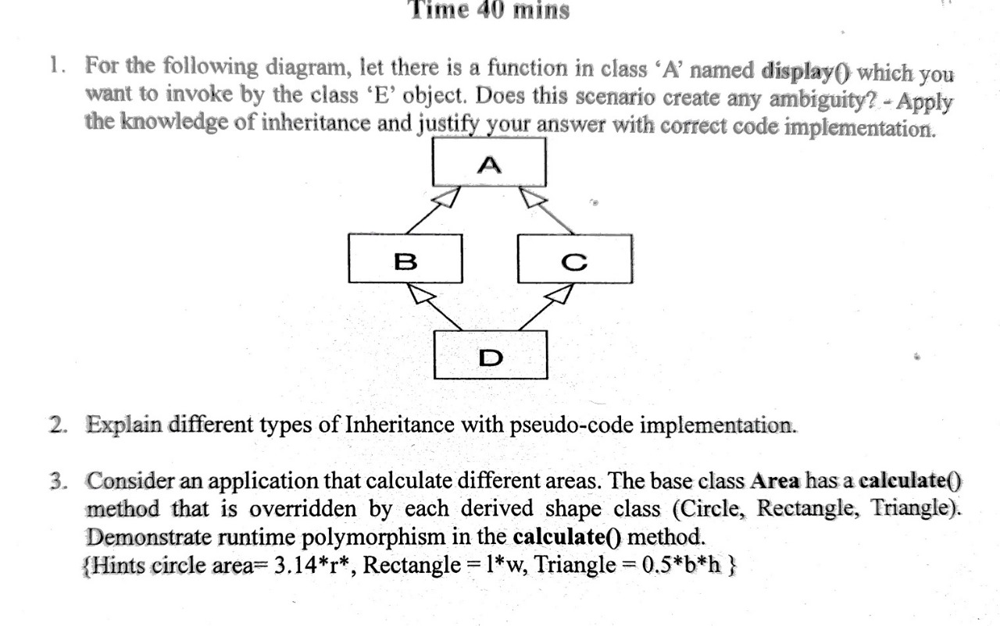

# Final CT 01

## Question 1


### Answer
Ans: **Kaniz**

```cpp
#include <iostream>
using namespace std;

class A
{
    public:
    void display()
    {
        cout<<"Kaniz Fatema"<<endl;
    }
};
class B : virtual public A
{

};
class C : virtual public A
{
    
};
class D : public B, public C
{
    
};
int main()
{
    D obj;
    obj.A::display();

}
```

## Question 3

### Answer
Ans: **Kaniz**

```cpp
#include <iostream>
using namespace std;
class Area
{
    public:
    virtual float calculate()
    {
      cout<<"kaniz"<<endl;
      return 0;
    }
};

class circle: public Area
{
    private:
    float r;
    public:
    circle(float x)
    {
        r=x;
    }
    float calculate()
    {
      return 3.1416*r*r;
    }
};
class Rectangle: public Area
{
    private:
    float a,b;
    public:
    Rectangle(float x,float y)
    {
        a=x;
        b=y;
    }
    float calculate()
    {
      return a*b;
    }
};
class Triangle: public Area
{
    private:
    float a,b;
    public:
    Triangle(float x,float y)
    {
        a=x;
        b=y;
    }
    float calculate()
    {
      return 0.5*a*b;
    }
};
int main()
{
    float a,b;
    cout<<"A: ";
    cin>>a;
    cout<<"B: ";
    cin>>b;

    circle obj(a);
    Rectangle obj1(a,b);
    Triangle obj2(a,b);
   
   Area *p;
   p= &obj;
   cout<<"Circle: "<< p-> calculate() << endl;

   p= &obj1;
   cout<<"Rectangle: "<< p-> calculate() << endl;

   p= &obj2;
   cout<<"Triangle: "<< p-> calculate() << endl;
}
```